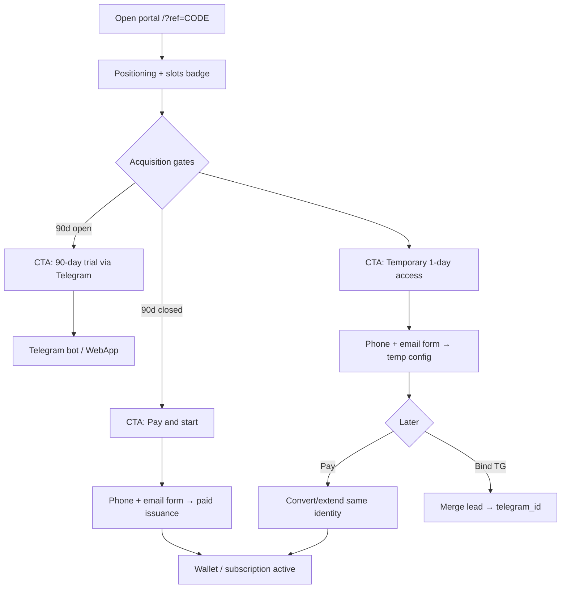

# ARCH — Portal-First Acquisition Journey

**ID:** ACQUISITION-JOURNEY-001  
**Date:** 2026-06-10  
**Mode:** architecture + product design · **no implementation** · no prod mutation  
**Branch:** `product-referral-cabinet-ui-v1`  
**Parent:** [`ARCH-2026-06-10-REFERRAL-ACQUISITION-PORTAL-ANALYTICS.md`](ARCH-2026-06-10-REFERRAL-ACQUISITION-PORTAL-ANALYTICS.md), [`BENDERVPN-PRODUCT-POLICY.md`](BENDERVPN-PRODUCT-POLICY.md), [`ARCH-2026-06-10-MULTI-DEVICE-BILLING-ENFORCEMENT.md`](ARCH-2026-06-10-MULTI-DEVICE-BILLING-ENFORCEMENT.md)  
**Evidence method:** code + docs + postdeploy only. Status: **CONFIRMED** / **PARTIAL** / **BLOCKED** / **NOT IMPLEMENTED** / **TARGET**.

---

## 1. Executive summary

| Question | Answer |
|----------|--------|
| **Primary acquisition surface** | **TARGET:** portal referral landing `{PUBLIC_PORTAL_ORIGIN}/portal/?ref={ref_code}` |
| **Bot role** | Secondary CTA + backward-compatible `ref_*`; must respect same gates |
| **Slot counter (30 000)** | **TARGET:** active devices/settings (non-expired tracked configs); **MVP proxy:** non-expired `vpn_keys` count — **not proven** for public display |
| **90-day trial cutoff (~300)** | **TARGET:** new 90d trials close when **active config count ≥ cap**; aligns with policy §1 threshold |
| **Temporary 1-day access** | **TARGET:** identity-bound temp config (model **B**), not disposable orphan config |
| **Paid conversion** | **NOT IMPLEMENTED** — extend same identity/config where possible |
| **Referral reward** | **NOT LIVE** — target +1 month to **referrer** after invitee paid conversion (`REF-BONUS-001`) |
| **Referral growth** | **NO-GO** until G4 bind, REF-ADMIN, REF-METRICS, anti-abuse, reward controls |

**This document does not authorize deploy, Remna mutation, billing changes, or live capacity/reward claims.**

---

## 2. Current state

### 2.1 What exists today (CONFIRMED)

| Layer | Behavior | Evidence |
|-------|----------|----------|
| **Referral share URL** | Bot-only `t.me/...?start=ref_{code}` | `handlers.referral_invite_payload` |
| **Portal `?ref=` capture** | Landing stores ref in `localStorage`; welcome panel | `setup.js`, `ru.json` |
| **Web email 1d trial** | `issue_web_trial` → web surrogate uid + `web_trial_claims` + panel key | `portal_web_trial.py`, `WEB_TRIAL_DAYS=1` |
| **TG 90d trial** | Bot issues key when `trial_used=0`; no global cap | `handlers.py`, `REMNA_TRIAL_DAYS=90` |
| **Referral attribution** | `referred_by` + `referrals` row; web via `apply_web_referral` | P1-REF-001 POSTDEPLOY PASS |
| **TG bind migration** | Code exists; **live BLOCKED** | G4 bind FAIL |
| **Hidden invitee +3d** | **Gated OFF** (P1-REF-002) | `REFERRAL_INVITEE_FIRST_PURCHASE_BONUS_ENABLED` default OFF |
| **Capacity badge** | Hidden in portal UX | UX-207 |
| **Capacity ops** | `ops/capacity_snapshot.py` — panel users, node soft cap | Not wired to portal |
| **Phone on web trial** | Optional field in schema; not required in all flows | `web_trial_claims.contact_phone` |
| **Paid start from portal** | **NOT IMPLEMENTED** | No web checkout for new leads |
| **Slot counter on portal** | **NOT IMPLEMENTED** | — |
| **Trial cap at 300** | **NOT IMPLEMENTED** | Policy text only |

### 2.2 What is blocked or misaligned

| Gap | Impact |
|-----|--------|
| Portal-first share URL not generated | Invitees skip portal education |
| No unified acquisition lead model | Duplicate configs / lost attribution risk |
| No public slot API | Cannot show `30000 − N` honestly |
| No trial cap enforcement | Bot can still issue 90d after threshold |
| G4 bind FAIL | Web lead → TG identity fragile |
| No paid conversion from portal lead | Temp access dead-ends without TG |
| MODEL A not implemented | Slot count ≠ per-device billing yet |

---

## 3. Target customer journey

### 3.1 Inviter (registered user)

1. User opens cabinet or bot «Пригласить».
2. Copies **portal-first** link: `{PUBLIC_PORTAL_ORIGIN}/portal/?ref={ref_code}`.
3. Bot `t.me/...?start=ref_{code}` remains available as secondary/deep link.

### 3.2 Invitee (new visitor) — portal-first



### 3.3 Path priority by phase

| Phase | Primary CTA | Secondary | Hidden/de-emphasized |
|-------|-------------|-----------|----------------------|
| **Early (under 300 active configs)** | 90-day Telegram trial | Paid start | 1d temp (fallback only) |
| **Post-cap (≥300 active configs)** | Paid start | 1d temporary access | 90-day trial **closed** for new users |
| **Near capacity (→30 000)** | Waitlist / «мест мало» | Paid if slots remain | New trials restricted |

**Grandfather rule:** Users who already received 90d trial keep remaining time; cap affects **new** issuances only.

---

## 4. Portal-first referral flow

| Step | Action | Data write | Status |
|------|--------|------------|--------|
| 1 | Invitee lands on `/portal/?ref=CODE` | `localStorage.bvpn_ref_code`; optional server-side cookie later | **PARTIAL** — client only |
| 2 | Portal shows «Вас пригласили» if ref valid | Lookup `referrer_code` → masked inviter label (no PII) | **NOT IMPLEMENTED** |
| 3 | User picks path (trial / paid / temp) | `acquisition_leads` row (target) | **NOT IMPLEMENTED** |
| 4 | User submits phone + email (paid/temp) | Lead record + normalized contacts | **PARTIAL** — email only today |
| 5 | Attribution | `referred_by = ref_code` on lead/user; `referrals` insert once | **CONFIRMED** pattern via `link_referral` |
| 6 | Config issuance | One tracked `vpn_keys` row tied to lead | **PARTIAL** — web trial only |
| 7 | Optional TG bind | `merge_web_user_to_telegram` | **BLOCKED** live |

**Backward compatibility:** `t.me/...?start=ref_*` must still call `link_referral` and land user on same gate logic (bot reads shared gate API).

**Public URL builder (target):**

```text
{portal_origin()}/portal/?ref={ref_code}
```

Use `shop_bot.public_urls.portal_origin()` + `PUBLIC_PORTAL_ORIGIN` env — same as REF-PORTAL-001.

---

## 5. Slot counter definition

### 5.1 Why devices/settings, not accounts

Server load scales with **active VPN configs** (panel users + subscription fetches), not Telegram registrations or email leads. Policy PT-04: **30 000 active configs**.

MODEL A target: each physical device = one tracked config → slot count = active billable devices. See [`ARCH-2026-06-10-MULTI-DEVICE-BILLING-ENFORCEMENT.md`](ARCH-2026-06-10-MULTI-DEVICE-BILLING-ENFORCEMENT.md) §3.

### 5.2 Target metric (post–MODEL A)

| Metric | Definition |
|--------|------------|
| `active_billable_device_count` | Count of non-expired `vpn_keys` rows where panel user `expireAt > now` and status active |
| `slots_remaining` | `CAPACITY_SLOTS_HARD_STOP_AT − active_billable_device_count` (default 30 000) |
| `slots_display` | Floor at 0; show approximate badge only when `CAPACITY_SLOTS_PUBLIC_ENABLED` and metric **proven** |

### 5.3 MVP proxy (until MODEL A + DEVICE-ENFORCE-001)

| Proxy | Query | Caveat |
|-------|-------|--------|
| **P0 proxy** | `COUNT(vpn_keys WHERE expiry_date > now)` in shop DB | Includes orphans if manual Remna; may **undercount** URL-sharing load |
| **P0 cross-check** | `capacity_snapshot.py` panel user pagination | Different DB; use ops-only until reconciled |
| **Do not claim** | «Точно 30 000 − N мест» in UI until reconcile job PASS | PT-12 |

**Recommendation:** Ship portal badge as **«примерно N мест»** or hide until `ACQ-SLOTS-001` reconcile smoke PASS. UX-207 hidden state remains correct for MVP.

### 5.4 Hard stop vs display

| Gate | Purpose | Default |
|------|---------|---------|
| `CAPACITY_SLOTS_PUBLIC_ENABLED` | Show counter on portal | **OFF** |
| `CAPACITY_SLOTS_HARD_STOP_ENABLED` | Block new issuance at cap | **OFF** until ops proof |
| `CAPACITY_SLOTS_HARD_STOP_AT` | Numeric cap | **30000** |

---

## 6. 90-day trial cutoff after ~300 users

### 6.1 Recommended counting rule (MVP)

**Count: non-expired active configs (`vpn_keys` with `expiry_date > now()`), not registrations.**

| Option | Verdict | Why |
|--------|---------|-----|
| Registered leads | **Reject** | Inflated; no infra load |
| Issued trial users ever | **Reject** | Expired trials would still block new users |
| Verified phone/email | **Reject** | Verification not MVP; abuse-prone |
| **Active configs/devices** | **Accept** | Matches policy §1 «~300 active configs» and infra truth |

**Align with policy:** At cap, **new** Telegram trials become **30 days** for users without referral (policy §1). This architecture doc treats **closing 90d entirely** as owner option after cap — **owner decision §12.1**.

### 6.2 Edge cases

| Case | Handling |
|------|----------|
| User has 90d trial, cap reached later | **Grandfather** — no revocation |
| Web 1d temp config active | Counts toward cap |
| Expired config | Does not count |
| Orphan Remna user without `vpn_keys` | Ops reconcile; exclude from public counter until fixed |
| Referral invitee at cap | **Owner decision:** referral bypass vs same cap (recommend: **same cap** for fairness until REF-METRICS) |
| Bot issues trial while portal shows closed | **Bug** — gates must share one API |

### 6.3 Portal/bot consistency

Single source of truth: **`GET /api/acquisition/gates`** (new, ACQ-PORTAL-001) backed by `bot_src/config.py` + live counts.

Bot `start_handler` / trial handlers **must** call same gate function before `provision_key`.

---

## 7. Temporary 1-day access

### 7.1 Model comparison

| Model | Description | Verdict |
|-------|-------------|---------|
| **A** | Disposable temp config; new config after payment | **Reject** — orphan configs, lost attribution |
| **B** | Lead + temp config tied to acquisition identity; convert/extend on payment | **Accept MVP** — owner direction |
| **C** | Lead only; config only after TG bind | **Reject for portal-first** — blocks paid/temp without TG |

### 7.2 Recommended MVP lifecycle (model B)

1. **Lead create:** `acquisition_leads` (or extend `web_trial_claims`) with normalized `email`, `phone`, `ref_code`, `source=portal_temp`.
2. **Identity key:** `web_user_id` surrogate (existing pattern) stable per email.
3. **Attribution:** `apply_web_referral(ref_code, web_user_id)` before issuance.
4. **Issuance:** One `vpn_keys` row + panel user (`provision_key`, `days=WEB_TRIAL_DAYS`).
5. **Expiry:** Panel `expireAt` lapses; scheduler marks inactive; portal shows «срок истёк» + pay CTA.
6. **Conversion to paid:** Same `web_user_id` / `key_id` — extend expiry + enable wallet debit (ACQ-PAID-CONVERT-001); **do not** mint second panel user for same lead if avoidable.
7. **TG bind (optional):** Merge lead → `telegram_id`; preserve `referred_by` (ACQ-BOT-BIND-001 / G4).

### 7.3 Phone + email requirement

| Field | Rule |
|-------|------|
| **Email** | Required; normalized; primary dedup key (existing) |
| **Phone** | **Required for new portal issuance flows** (target); E.164 normalize; secondary dedup |
| **Terms** | Required checkbox (existing `set_terms_agreed`) |

**Not MVP today:** SMS OTP verification (policy: no SMS at MVP).

---

## 8. Identity model

### 8.1 Identifiers

| ID | Scope | Storage today | Target |
|----|-------|---------------|--------|
| `ref_code` | Inviter | `users.ref_code` | Unchanged |
| `referred_by` | Invitee attribution | `users.referred_by` | Set once; no overwrite |
| `web_user_id` | Portal lead surrogate | Negative int from email hash | Primary pre-TG identity |
| `telegram_id` | Canonical post-bind | `users.telegram_id` | Merge target |
| `contact_email` | Lead lookup | `web_trial_claims` | Unique |
| `contact_phone` | Lead lookup | `web_trial_claims.contact_phone` | Unique index (target) |
| `customer_id` | Support-facing | `BVPN-########` | Show in portal post-signup |
| `key_id` / `panel_email` | Device/config | `vpn_keys` | One per issuance path |

### 8.2 Merge precedence (target)

When matching payment or bind:

1. Explicit `lead_id` / `web_user_id` in session token  
2. Normalized email (exact)  
3. Normalized phone (exact)  
4. `telegram_id` (after bind)  
5. `ref_code` alone — **never** sufficient for payment match  

---

## 9. Paid conversion

### 9.1 Paths

| Path | Trigger | Target behavior | Status |
|------|---------|-----------------|--------|
| **Direct paid start** | User chooses pay without trial | Lead + payment + extend new config | **NOT IMPLEMENTED** |
| **Temp → paid** | 1d expired or user pays early | Same `key_id` / panel user extend; wallet on bind or web wallet | **NOT IMPLEMENTED** |
| **90d trial → paid** | Trial user tops up balance | Existing wallet path in bot | **CONFIRMED** bot-only |
| **Legacy plan purchase** | YooKassa metadata months | `process_successful_payment` | **CONFIRMED**; invitee bonus gated OFF |

### 9.2 Duplicate handling

| Scenario | Action |
|----------|--------|
| Same email, second signup attempt | Return existing lead state; no second config |
| Same phone, different email | Flag `duplicate_suspect`; block auto-issue; support queue |
| Temp expired, user returns | Match by email → offer pay / re-issue temp (owner: **one temp per email lifetime** — recommend **yes**) |
| Paid user tries temp again | Deny temp; show cabinet/pay |
| Web lead + later TG organic | Bind merges; **do not** create second `referred_by` if already set |
| Two configs same lead | **Prevent** — extend existing row |

### 9.3 Unlinked config prevention

**Rule:** No `provision_key` without a shop DB row (`vpn_keys` + lead/user). Manual Remna prohibited (DEVICE-ARCH §3.3).

---

## 10. Referral attribution

### 10.1 Preservation

| Event | Attribution |
|-------|---------------|
| Portal land `?ref=` | Store ref on lead at signup (server-side target; localStorage interim) |
| Web trial/temp POST | `apply_web_referral` → `referred_by` + `referrals` |
| TG `/start ref_*` | `link_referral` |
| TG bind | Migrate `referred_by` + `referrals.referred_user_id` | **BLOCKED** live |
| Paid conversion | **Do not clear** `referred_by`; log `first_paid_conversion` action (target) |

### 10.2 Future +1 month referrer reward

| Item | Status |
|------|--------|
| Trigger | Invitee **first confirmed paid conversion** (wallet debit or successful payment) |
| Recipient | **Referrer**, not invitee |
| Amount | +1 calendar month |
| Flag | `REFERRAL_REFERRER_FIRST_PAYMENT_REWARD_ENABLED` **OFF** |
| Idempotency | One reward per `(referrer_code, invitee_user_id)` |
| **Blocked until** | REF-ADMIN-001, REF-METRICS-001, anti-abuse, G4 bind confidence, REF-BONUS-001 |

**Do not promise in portal copy.**

---

## 11. Anti-abuse and admin/support requirements

### 11.1 Lookup (REF-ADMIN-001)

| Key | Lookup |
|-----|--------|
| Phone | Lead + user |
| Email | Lead + user |
| `ref_code` | Inviter + invitee list |
| `telegram_id` | User + keys + referral |
| `customer_id` | `web_trial_claims` |

### 11.2 Ledgers

| Ledger | Contents |
|--------|----------|
| **Referral** | inviter → invitee → status (linked / trial / temp / paid) |
| **Temporary access** | email, phone, issued_at, expires_at, config_id, converted? |
| **Paid conversion** | payment_id, lead_id, amount, first_paid_at |

### 11.3 Abuse rules (minimum)

| Rule | Action |
|------|--------|
| Self-referral | Block (`link_referral` existing) |
| Same IP cluster many signups | Flag; throttle issuance |
| Disposable email domains | Blocklist (config) |
| Duplicate phone across emails | Hold; support |
| Rapid temp re-requests | Rate limit per phone/email |
| Referral without ever activating | OK for tracking; no reward |

### 11.4 Manual support correction

Admin path (target): rebind lead → correct `referred_by` (audit log), merge duplicate leads, extend temp once, revoke abuse config — **DEVICE-ADMIN-001** / REF-ADMIN-001.

---

## 12. Feature flags / config gates

Proposed names (repo style, `bot_src/config.py` + env):

| Flag | Default | Purpose |
|------|---------|---------|
| `ACQ_TRIAL_90D_ENABLED` | `true` | Master switch for new 90d Telegram trials |
| `ACQ_TRIAL_90D_ACTIVE_CONFIG_CAP` | `300` | Close 90d when active config count ≥ cap |
| `ACQ_TEMP_ACCESS_1D_ENABLED` | `true` | Allow portal 1d temporary path |
| `ACQ_PAID_START_ENABLED` | `false` | Portal paid start without TG (enable after BILL-SMOKE) |
| `ACQ_PORTAL_PHONE_REQUIRED` | `false` → `true` when ACQ-IDENTITY-001 ships | Require phone on issuance forms |
| `CAPACITY_SLOTS_PUBLIC_ENABLED` | `false` | Show slots badge |
| `CAPACITY_SLOTS_HARD_STOP_ENABLED` | `false` | Block issuance at cap |
| `CAPACITY_SLOTS_HARD_STOP_AT` | `30000` | Hard cap |
| `WEB_TRIAL_DAYS` | `1` | **Exists** — temp access duration |
| `REMNA_TRIAL_DAYS` | `90` | **Exists** — TG trial duration |
| `REFERRAL_REFERRER_FIRST_PAYMENT_REWARD_ENABLED` | `false` | **Exists** — referrer +1m; not implemented |

**Portal consumption:** read-only JSON from bot webhook app (`ACQ-PORTAL-001`). No duplicate caps in `ru.json`.

---

## 13. Portal UI requirements (target)

| Block | Content |
|-------|---------|
| Positioning | Invite-only / камерный VPN / digital membership |
| Slots | «Осталось примерно N мест» — only if `CAPACITY_SLOTS_PUBLIC_ENABLED` + metric proven |
| Referral welcome | If `?ref=` — «Вас пригласили»; no bonus promise |
| CTA 90d trial | While `ACQ_TRIAL_90D_ENABLED` and under cap — opens Telegram |
| CTA paid start | Price framing 6,67 ₽/день; requires phone+email |
| CTA temp 1d | Fallback; phone+email; explains 1 day + next steps |
| Device rule | One setting = one device (MODEL A honest copy) |
| Legal | 90d (TG) vs 1d (temp) distinction — existing legal pages |

---

## 14. Bot requirements (target)

| Rule | Detail |
|------|--------|
| Secondary entry | Menu links to portal; `ref_*` still works |
| Gate sync | Refuse 90d trial if cap reached (same gate API) |
| Paid start | Top-up + wallet path; existing |
| Attribution | Never overwrite `referred_by` |
| Bind | `merge_web_user_to_telegram` for portal leads |
| Copy | No bonus; no false capacity precision |

---

## 15. Implementation backlog

| ID | Surface | Objective | Depends | Deploy? |
|----|---------|-----------|---------|---------|
| **ACQ-PORTAL-001** | portal + webhook | Referral landing UX, gate API, portal-first share URL builder | REF-PORTAL-001 spec | Yes |
| **ACQ-IDENTITY-001** | DB + webhook | `acquisition_leads` schema; phone required; dedup indexes | — | Yes |
| **ACQ-TRIAL-CAP-001** | bot + API | Active config count; close 90d at cap; bot+portal sync | ACQ-SLOTS-001 proxy | Yes |
| **ACQ-TEMP-001** | portal + bot | Model B temp flow; phone+email; tied config | ACQ-IDENTITY-001 | Yes |
| **ACQ-PAID-CONVERT-001** | billing + portal | Paid start + temp→paid extend same config | BILL-SMOKE, ACQ-TEMP-001 | Yes |
| **ACQ-BOT-BIND-001** | bot | G4 bind retest + merge hardening | G4 PASS | Yes |
| **ACQ-SLOTS-001** | ops + API | `active_config_count` + reconcile with panel; public badge | capacity_snapshot | Yes |
| **REF-PORTAL-001** | portal + bot | Share URL = portal `?ref=` | ARCH approved | Yes |
| **REF-ADMIN-001** | admin + ops | Referral + temp ledgers; lookup | — | Yes |
| **REF-METRICS-001** | DB + scheduler | Conversion statuses on referrals | REF-ADMIN-001 | Yes |
| **REF-BONUS-001** | billing + bot | +1 month referrer on first paid conversion | All reward controls | Yes |

**Explicitly not in this pass:** MODEL A multi-device billing, HWID enforcement, SMS verify, public ads.

---

## 16. Launch gates

| Launch mode | Acquisition requirements |
|-------------|-------------------------|
| **Closed soft launch (F&F)** | Tracking-only referral; no slot badge; no false trial/cap claims; existing TG 90d + email 1d OK |
| **Paid pilot** | G6 billing smokes; ACQ-PAID-CONVERT-001; DEVICE-ENFORCE-001 or waiver; honest copy |
| **Open commercial** | Capacity hard stop or waitlist; trial cap enforced; support lookup; MODEL A path defined |
| **Referral-driven growth** | G4 bind PASS; REF-ADMIN + REF-METRICS; anti-abuse; portal-first share live; **REF-BONUS-001 only if owner approves reward** |

---

## 17. Owner decisions required

| # | Decision | Options | Recommendation |
|---|----------|---------|----------------|
| **12.1** | At 300 cap: close 90d vs reduce to 30d | A: close 90d / B: 30d non-referral / C: 30d all new | **B** — matches policy §1 text |
| **12.2** | Referral bypass at trial cap? | Yes / No | **No** — same cap until metrics |
| **12.3** | One temp 1d per email lifetime? | Yes / No | **Yes** — anti-abuse |
| **12.4** | Public slot counter before reconcile proof? | Show approximate / Hide | **Hide** until ACQ-SLOTS-001 PASS |
| **12.5** | Phone required day-one or phase 2? | Required / Optional | **Required** for new portal issuance (ACQ-IDENTITY-001) |
| **12.6** | Approve portal-first share as default | Yes / No | **Yes** (OPTION 3 Hybrid) |

---

## 18. References

| Artifact | Role |
|----------|------|
| `bot_src/public_urls.py` | `portal_origin()`, share URL base |
| `bot_src/portal_web_trial.py` | Current 1d web trial |
| `bot_src/web_trial_db.py` | Lead/email/phone/bind schema |
| `bot_src/web_referral.py` | Attribution |
| `bot_src/web_tg_bind.py` | Identity merge |
| `bot_src/config.py` | Trial days, reward flags |
| `ops/capacity_snapshot.py` | Ops capacity proxy |
| [`ARCH-2026-06-10-REFERRAL-ACQUISITION-PORTAL-ANALYTICS.md`](ARCH-2026-06-10-REFERRAL-ACQUISITION-PORTAL-ANALYTICS.md) | Referral analytics |
| [`ARCH-2026-06-10-MULTI-DEVICE-BILLING-ENFORCEMENT.md`](ARCH-2026-06-10-MULTI-DEVICE-BILLING-ENFORCEMENT.md) | Device = config, billing coefficient |
| [`ARCH-2026-06-10-QA-SANDBOX-CUSTOMER-JOURNEYS.md`](ARCH-2026-06-10-QA-SANDBOX-CUSTOMER-JOURNEYS.md) | Scenario matrix + staging harness before ACQ features ship |

---

**Document status:** architecture complete · implementation **NOT STARTED** · owner decisions §17 pending
