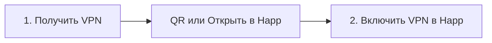

# Аудит клиентского UX — 2026-05

**Цель:** путь «дед с первого раза», идеал **2 кнопки** до рабочего VPN; отдельно — **email ≠ 3 месяца бесплатно**.

**Связь:** `docs/USER-FLOW-JOURNEY.md`, `docs/USER-FLOW-BACKLOG.md`, `web/portal/content/ru.json`.

---

## 1. Сводка (оценка)

| Канал | Сейчас (шагов до VPN) | «Дед-тест» | Главная боль |
|-------|------------------------|------------|--------------|
| **Telegram бот** | 6–10 тапов + Happ вручную | ⚠️ | Оферта, 8+ кнопок после trial, нет 1-tap Happ |
| **/setup/ email** | 4–6 + Happ | ⚠️ | Было «3 месяца» на email (**исправлено → 1 сутки**) |
| **Mini App / portal** | 3–5 + Happ | ⚠️ | QR на «устройствах» только если уже есть URL в localStorage |
| **«Открыть в Happ»** | 1 кнопка, но **не deep link** | ❌ | Открывает HTTPS sub в браузере, не импорт в Happ |

**Итог:** продукт **рабочий для терпеливого пользователя**; до «2 кнопок» не хватает **одношагового импорта в Happ** и **сжатия веток** (меньше кнопок, один главный CTA).

---

## 2. Где «не жмётся» / топорно

### 2.1 Telegram-бот

1. **Оферта** — без «Принимаю» дальше никуда; старые inline-кнопки после рестарта → «Загрузка…».
2. **После trial** — длинное сообщение + **8+ кнопок** (ЛК, мастер, QR, copy, 2 магазина, аккаунт, поддержка).
3. **Два магазина** на клавиатуре trial без выбора ОС (iPhone/Android).
4. **«Моя настройка»** vs **сырая sub-ссылка** vs **`/setup/?t=`** — три формата, путает поддержку.
5. **Выбор узлов** (turbo / wl-*) в тексте — лишнее для новичка.
6. **Windows** — v2rayN в текстах, в бете **не коннектится**; Happ — единственный проверенный клиент.

### 2.2 Сайт `/setup/` и portal

1. **Форма email + чекбокс + «Получить VPN»** — нормально, но не «2 кнопки».
2. **Happ:** «+ → из буфера» или QR — **всегда 4 шага** в `ru.json` → `happ_steps`.
3. **`btn-open-happ`** — `href = sub_url` (HTTPS), **не** `happ://` → часто Safari/Chrome, не Happ.
4. **«Как установить Happ»** на главной — QR **пустой**, если пользователь не проходил `/setup/` (нет URL в `localStorage`).
5. **Шаг 2 Telegram** после VPN — правильно по продукту, но выглядит как «ещё одна обязаловка».

### 2.3 Email / abuse (критично для бизнеса)

| Было | Стало (репо) |
|------|----------------|
| `issue_web_trial` → **90 дней** (`REMNA_TRIAL_DAYS`) | **`WEB_TRIAL_DAYS=1`** только для `/setup/` |
| `recover` мог **перевыдать 90 дней** | Только **активный** ключ; иначе `trial_expired` + привязка TG |

**Telegram trial** по-прежнему **~90 дней** (`get_trial` в боте) — для идентификации и полноценного онбординга.

---

## 3. Целевой флоу «2 кнопки» (to-be)



| Кнопка | Действие |
|--------|----------|
| **1** | Выдача sub (бот / email / trial) + **один** способ импорта |
| **2** | Toggle VPN в Happ |

**Блокеры в репо:**

- Нет стабильного **`happ://` import subscription** в документации Happ для HTTPS sub (есть routing deeplinks, [issue #11](https://github.com/Happ-proxy/happ-ios/issues/11) — feature request).
- Пока: **QR на том же экране** = лучший «1 тап» после установки Happ (скан → импорт).

---

## 4. Happ: ссылка без copy-paste

| Вариант | Статус | Действие |
|---------|--------|----------|
| QR на `/setup/` | ✅ | Оставить крупным, первым на мобиле |
| «Открыть в Happ» = HTTPS sub | ⚠️ | Переименовать в UI: «Ссылка подписки» + подсказка «если Happ уже стоит — скопируйте» |
| `happ://` import | ❌ | **P3-FLOW-18** — исследовать Happ Limited Links / dev-docs; A/B на iOS/Android |
| Universal Link | ❓ | Зависит от Happ; не в репо |

---

## 5. Рекомендуемый бэклог (приоритет)

| ID | Задача | Эффект |
|----|--------|--------|
| **P3-FLOW-18** | Happ one-tap import (deeplink / limited link / provider id) | −2 шага, ближе к «2 кнопки» |
| **P3-FLOW-19** | Бот после trial: **3 кнопки** (QR, Happ-магазин по ОС, поддержка) | Меньше когнитивной нагрузки |
| **P3-FLOW-20** | Portal: QR на странице устройства без localStorage (API по `?t=` или session) | Убирает «пустой QR» |
| **P3-FLOW-21** | Автовыбор одного узла «Подключить» в sub template (скрыть turbo/wl для trial) | Меньше путаницы в Happ |
| **P3-FLOW-22** | Логи support delivery на WARNING (уже обсуждалось с владельцем) | Операционка |

**Деплой email 1d:** `WEB_TRIAL_DAYS=1` в `/opt/remna-shop/.env` + `deploy-bot-handlers-ams.ps1` / portal sync на LV.

**Разделение TG / email (2026-05):** Mini App и `/setup/` в Telegram больше **не показывают форму email** — API `/setup/api/telegram-setup` → `/setup/?t=` по подписке из бота. Email-only остаётся для обычного браузера без `Telegram.WebApp`.

---

## 6. Проверка после правок

```bash
python -m py_compile bot_src/portal_web_trial.py bot_src/config.py
python ops/smoke_web_trial_browser.py   # поле days: 1 на новых выдачах
```

Владелец: бабушка-тест по `docs/USER-FLOW-JOURNEY.md` — один путь iPhone через `/setup/` + один через бот.
