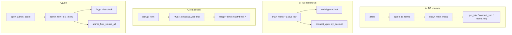

# Аудит трёх пользовательских флоу + админ «Тест флоу»

**Дата:** 2026-05-19  
**Цель:** второе мнение — логика, работоспособность, куда ведёт каждая кнопка, неудобства и баги.  
**Контекст:** владелец целый день отлаживал гиды и «Диагностику» в админке; часть кнопок «молчит» или зависает на «⏳ Диагностика…».

---

## 1. Три флоу (кратко)

| # | Флоу | Точка входа | Успех для пользователя |
|---|------|-------------|------------------------|
| **A** | Новичок в Telegram | `/start` → «Принимаю» → главное меню | Trial / мастер «Как подключить» → Happ → VPN |
| **B** | Подписчик в Telegram | Главное меню с активным ключом | Кабинет (WebApp), «Мой VPN», пополнение |
| **C** | Email / браузер | `https://…/setup/` | Email → trial 1 день → QR/ссылка → привязка TG в боте |

**Админ-зеркало:** Админ-панель → «Тест флоу» → три гида + «Диагностика сервера» (`bot_src/admin_handlers.py`, `admin_flow_guide.py`, `admin_flow_test.py`).

---

## 2. Матрица кнопок (куда ведёт)

### 2.1 Флоу A — главное меню без подписки

| Кнопка | `callback_data` / URL | Обработчик | Файл |
|--------|----------------------|------------|------|
| Бесплатно 3 месяца | `get_trial` | `get_trial_handler` | `handlers.py` |
| Как подключить | `connect_vpn` | `connect_vpn_wizard_*` | `handlers.py` |
| Помощь | `menu_help` | `menu_help_handler` | `handlers.py` |
| Помощь (дубль) | `menu_help` | то же | `keyboards.py` — две кнопки «? Помощь» |
| Админ-панель | `open_admin_panel` | `open_admin_panel_handler` | `handlers.py` (не `admin_handlers`) |

**Первый контакт:** `UserAgreement` → `agree_to_terms` → `show_main_menu`.

### 2.2 Флоу B — главное меню с подпиской

| Кнопка | Действие |
|--------|----------|
| Кабинет | WebApp `telegram_cabinet_webapp_url(tid)` → `/portal/cabinet.html?tid=` |
| Мой VPN | `connect_vpn` (мастер) |
| Пополнить | `show_topup` |
| Мой аккаунт | `my_account` |

Кабинет: `portal.js` + API `portal_cabinet.py` (баланс, продление, bind).

### 2.3 Флоу C — `/setup/`

| UI | Endpoint / действие |
|----|---------------------|
| Форма email | `POST /setup/api/web-trial` → LV `setup_verify` → AMS `portal-web-trial` |
| Восстановление | `POST /setup/api/web-trial-recover` |
| Ссылка из письма `?t=` | `GET /setup/api/verify?t=` |
| Привязка TG | deep link `?start=bind_*` → `web_tg_bind.py` |

### 2.4 Админ «Тест флоу»

| Кнопка | `callback_data` | Поведение |
|--------|-----------------|-----------|
| Гид: новичок | `admin_flow_g_nb_1` … `nb_4` | Пошаговый текст + демо-клавиатуры |
| Гид: подписчик | `admin_flow_g_ex_1` … `ex_3` | Шаг 1 = **merge** реального main menu + nav |
| Гид: email/web | `admin_flow_g_web_1` … `web_4` | Только текст + URL-кнопки |
| Диагностика | `admin_flow_smoke_all` | `run_all_smokes(admin_id)` |
| В админ-панель | `open_admin_panel` | `handlers.py` → `create_admin_keyboard()` |
| Назад к тестам | `admin_flow_test_menu` | Меню гидов |

**Демо в гиде новичка:** `admin_demo_agree`, `admin_demo_hint_trial`, `admin_demo_hint_help` — **не** вызывают реальный `get_trial`, только alert/следующий шаг.

---

## 3. Критические баги и симптомы

### 3.1 «Диагностика» не работала (исправлено в этой сессии)

**Симптом:** сообщение застревает на «⏳ Диагностика…» или кнопка «ничего не делает».

**Причины (код до фикса):**

1. `admin_flow_smoke_all` вызывал `edit_text` **без** `parse_mode="HTML"`, хотя отчёт содержит `<b>`, `<code>` → `TelegramBadRequest`, исключение не ловилось.
2. `run_all_smokes` → `_probe_panel_api()` без таймаута → зависание на медленной панели, callback Telegram истекает.
3. Нет `try/except` — любая ошибка оставляет старый текст.

**Фикс:** `_edit_guide_message` + `asyncio.wait_for(30s)` + таймаут 14 с на Remna API + сообщение об ошибке пользователю.

**Проверка после деплоя:** открыть **новое** сообщение «Тест флоу» (старые inline-клавиатуры хранят устаревший `callback_data`).

### 3.2 Гид «новичок» «не работает»

| Причина | Что видит владелец |
|---------|-------------------|
| Старое сообщение с клавиатурой до деплоя | Callback не матчится / «Неизвестная кнопка» |
| На шаге 2 «Начать бесплатно» — только **alert**, не реальный trial | Ожидание выдачи ключа в гиде |
| `admin_flow_g_nb_1` и общий `startswith("admin_flow_g_")` | Дублирующая регистрация; сейчас отдельный handler для `nb_1` идёт первым — OK |
| Merge двух markup на шаге ex_1 | Telegram иногда не принимает `edit_message` — для nb вынесены отдельные клавиатуры |

### 3.3 Web `/setup/` — баг в JS (исправлено)

`setup.js` при невалидном токене вызывал `showError(s.invalid_token)` — переменная `s` **не определена** → белый экран / generic error вместо текста из `ru.json`.

### 3.4 Диагностика врёт «всё зелёное» по email

`smoke_email_web()` помечает `API web-trial` как `ok: True` **без HTTP-проба** — только комментарий в detail. Ревьюеру: не доверять зелёной галочке для POST trial.

### 3.5 Дубли и путаница UX (не блокеры, но бесит)

- Две кнопки «Помощь» (`menu_help`) в одном меню новичка.
- `menu_help` ≠ мастер `connect_vpn` — разный контент, пользователь не понимает разницу.
- Trial в боте: **3 месяца** в кнопке; web trial: **1 день** (`WEB_TRIAL_DAYS`) — разные продуктовые обещания.
- `get_trial` может выставить `trial_used` до успешного provision — при сбое панели повтор trial невозможен.
- `show_main_menu` раньше без `parse_mode="HTML"` — жирный текст как сырой `<b>` (исправлено).

### 3.6 Архитектурная путаница для аудитора

- `open_admin_panel` на **`user_router`** (`handlers.py`), остальное админское на **`admin_router`** (`admin_handlers.py`). Порядок в `main.py`: сначала `admin_router`, потом `user_router` — OK.
- В `handlers.py` может быть неиспользуемый `admin_router` — не подключён в `main.py`; искать админку только в `admin_handlers.py`.

---

## 4. Чеклист для ручного прогона (ревьюер)

### A. Новичок TG (чистый аккаунт или тестовый)

1. `/start` → ссылки условий/политики открываются.
2. «Принимаю» → главное меню, HTML не сырой.
3. «Бесплатно 3 месяца» → ключ/ссылка или понятная ошибка.
4. «Как подключить» → выбор устройства → QR/ссылка Happ.
5. «Помощь» (обе?) → одинаковый ли результат — **ожидается расхождение с п.4**.

### B. Подписчик TG

1. «Кабинет» WebApp открывается, `tid` в URL, баланс грузится.
2. «Мой VPN» → тот же мастер, что после trial.
3. Пополнение → YooKassa/Stars (если включено).

### C. Email web

1. `/setup/` без токена — форма email.
2. Submit → письмо/ссылка с `?t=`.
3. Истёкший токен → текст «Ссылка устарела…», не JS-ошибка.
4. Happ → VPN → bind в боте.

### Админ

1. Главное меню → Админ → «Тест флоу» (**новое** сообщение).
2. «Гид: новичок» шаг 1–4, «Далее/Назад».
3. «Диагностика сервера» → отчёт за &lt;30 с или явная ошибка/таймаут.
4. Старый чат с кнопками до деплоя — **должен** ломаться; это не баг кода, а кэш Telegram.

---

## 5. Рекомендации по приоритету

| P | Действие |
|---|----------|
| P0 | Деплой фикса диагностики + `setup.js` на AMS/LV |
| P1 | Реальный HTTP smoke `POST /setup/api/web-trial` (healthcheck email) |
| P1 | Убрать дубль «Помощь» или переименовать («FAQ» vs «Настройка VPN») |
| P2 | `get_trial`: ставить `trial_used` только после успешного создания ключа |
| P2 | В гиде новичка шаг 2: кнопка «Симуляция trial» с `edit` на шаг 3 без только alert |
| P3 | Единый copy: 3 мес (TG) vs 1 день (web) — пояснение в UI |

---

## 6. Файлы для углублённого ревью

| Область | Файлы |
|---------|--------|
| TG handlers | `bot_src/handlers.py`, `bot_src/keyboards.py` |
| Админ гиды/диагностика | `bot_src/admin_handlers.py`, `admin_flow_guide.py`, `admin_flow_test.py` |
| Web setup | `web/portal/setup.html`, `assets/setup.js`, `content/ru.json` |
| API trial | `ops/setup_verify_service.py`, `bot_src/portal_web_trial.py`, `webhook_server/app.py` |
| Кабинет | `web/portal/assets/portal.js`, `bot_src/portal_cabinet.py` |

---

## 7. История правок по этому аудиту

- `admin_handlers.py`: диагностика через `_edit_guide_message`, timeout 30 с, обработка ошибок.
- `admin_flow_test.py`: таймаут Remna API 14 с.
- `handlers.py`: `parse_mode="HTML"` в `show_main_menu`.
- `setup.js`: `content.setup.invalid_token` вместо `s.invalid_token`.

**Передать ревьюеру:** этот файл + попросить прогон чеклиста §4 на проде с **новым** сообщением «Тест флоу».
