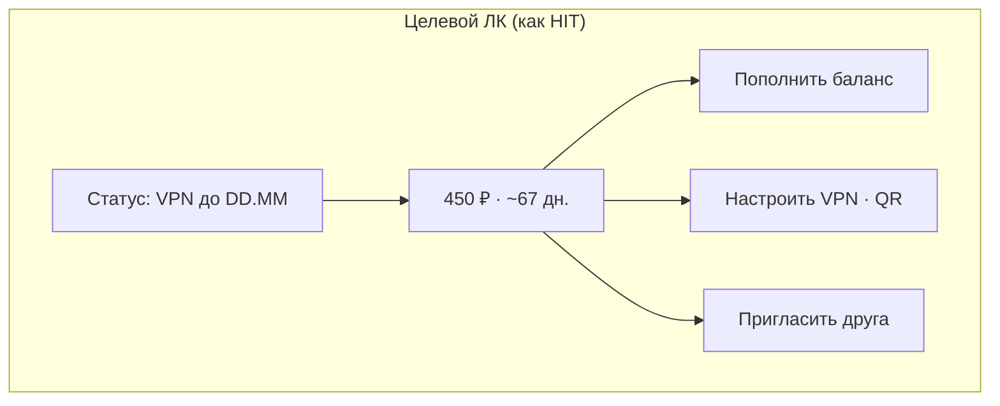

# Личный кабинет (Mini App) — образец и согласование

**Дата:** 2026-05  
**Референс в репо:** стиль портала ≈ **HITVPN** (`docs/RUNBOOK-TELEGRAM-MINIAPP.md` — тёмный UI, крупные CTA, один главный смысл на экран).  
**Проблема сейчас:** `cabinet.html` — «обрывок» портала: одна цифра баланса и 1–2 кнопки без контекста «зачем я здесь».

---

## 1. Как у HIT (best practice для VPN Mini App)

Один экран = **одна задача**. Для подписчика в Telegram это не «ещё один сайт», а **кошелёк + продление + быстрый доступ к настройке**.

| Блок | Зачем |
|------|--------|
| **Статус VPN** | «Работает до …» / «Нужно пополнить» — сразу понятно, жив ли доступ |
| **Баланс крупно** | Сколько ₽ и на сколько дней хватит (не красный «аварийный», если всё ок) |
| **Главная CTA** | Одна оранжевая: **Пополнить** → бот со Stars |
| **Вторичные** | Настроить VPN (QR) · Пригласить друга |
| **Подпись** | Тариф ₽/день — без жаргона «панель», «inbound» |

**Не смешивать** с главной `/portal/` (подключение новичка). Кнопка в боте «Личный кабинет» → **только** `cabinet.html?tid=`, не home портала.



---

## 2. Было → будет (согласовать)

| Сейчас (прод) | Целевое (этот спринт) |
|---------------|------------------------|
| Только баланс + 1–2 кнопки | Карточка: статус + баланс + 3 действия |
| Красный баланс при ≤3 дн. | Зелёный/циан норма; оранжев предупреждение; красный только 0 ₽ |
| «Открыть бота» в Mini App | Убрано; **Пополнить** = `?start=topup` |
| Нет срока подписки | Строка «VPN активен до …» из БД |
| Непонятно зачем ЛК | Lead: «Пополнение и настройка VPN — здесь; подключение новичка — в боте» |

### Макет (текстовый wireframe)

```
┌──────────────────────────────────────┐
│  Личный кабинет                       │
│  Баланс и продление. VPN — кнопки ниже│
├──────────────────────────────────────┤
│  ● VPN активен до 12.06.2026         │  ← статус-pill
│  ┌────────────────────────────────┐  │
│  │         450 ₽                  │  │
│  │    хватит примерно 67 дней     │  │
│  └────────────────────────────────┘  │
│  [  💳  Пополнить баланс        ]   │  primary
│  [  📱  Настроить VPN (QR)      ]   │  secondary
│  [  👥  Пригласить друга        ]   │  secondary
│  Тариф ~6,67 ₽/день · Telegram Stars │
└──────────────────────────────────────┘
```

---

## 3. «Тест флоу» в админке — не отдельный мир

**Сейчас:** гиды с «демо»-кнопками (alert), текст «шаг 1/4» — похоже на туториал, **не как прод**.

**Цель:** смотреть **тот же путь**, что пользователь на проде.

| Режим | Поведение |
|-------|-----------|
| **Просмотр** (оставить) | Текст + «Далее», без изменений БД |
| **Прод-сим** (новое) | Кнопки = **те же callback**, что у пользователя; вверху баннер «Вы админ: действия на вашем аккаунте»; trial не жмётся если `trial_used` — как у всех |

Шаг 2 гида новичка: показывать **реальное** `create_main_menu_keyboard(for_simulation=False)` с вашим `telegram_id`, не отдельные `admin_demo_*` (кроме «Принимаю» на шаге 1 — без записи в БД).

Детали: `docs/ADMIN-FLOW-PROD-REPLAY.md`.

---

## 4. Очередь CodeRabbit (UX) — сводка

Полный список: `docs/AUDIT-2026-05-UX-CODERABBIT-BACKLOG.md`.

**P0 (сделать в первую очередь после ЛК):**
- Q-UX-003: copy trial 3 мес (бот) vs 1 день (web) — единые формулировки
- Q-UX-004: убрать «inbound», «pull подписки» из `user_messages.py`
- Q-UX-012: после trial ≤4 кнопки (QR, Happ по ОС, поддержка)
- Q-UX-002: smoke email API — реальный HTTP, не `ok: True` заглушка

**P1:** дедуп помощи, WIZARD_STUCK URL (сделано), invite в меню (сделано), orphan handlers.

---

## 5. Чеклист согласования с владельцем

Отметьте **да/нет** — после этого один деплой ЛК v2:

- [ ] **A.** ЛК только для подписчика: статус + баланс + 3 кнопки (как макет выше)
- [ ] **B.** Не открывать общий `/portal/` из кнопки «Личный кабинет» в боте (уже `cabinet.html`)
- [ ] **C.** Админ «Тест флоу»: режим прод-сим с реальными callback (фаза 2)
- [ ] **D.** Сначала ЛК, потом Q-UX P0 из Rabbit

Комментарии: _____________________
