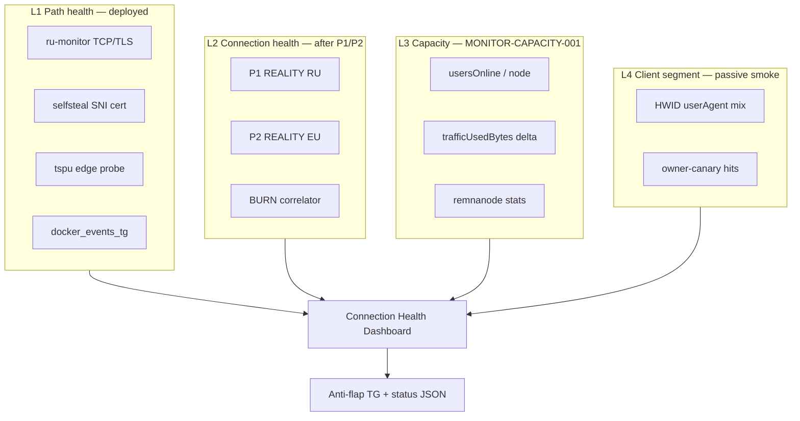

# Connection Health Dashboard — design (L1–L4)

**ID:** `MONITOR-CONNECTION-HEALTH-001`  
**Связано:** `MONITOR-CAPACITY-001` · `CONNECTION-HEALTH-P1P2-001` · `OBS-001`  
**Дата:** 2026-06-25  
**Режим:** design only · **без внедрения** (нет Grafana/deploy)

---

## 1. Цель

Один экран «здоровье соединений» для ops: **инфра-аномалии до волны жалоб**, без слежки за сайтами/маршрутами пользователей.

**No-log граница:** дашборд показывает агрегаты, probe results, node counters — **не** per-user destinations, access logs, sub paths.

---

## 2. Слои (L1–L4)

| Layer | Вопрос | Источник | Paging? |
|-------|--------|----------|---------|
| **L1** | Доступен ли путь / edge / контейнер? | `ru-monitor`, `selfsteal-monitor`, `tspu_block_probe`, `docker_events_tg` | Да (существующая политика) |
| **L2** | Жив ли REALITY handshake с RU? Burn IP? | P1/P2 + correlator | Да — suspect/likely only |
| **L3** | Есть ли перегруз / дисбаланс? | Panel API + `load_monitor.py` | WARN при порогах capacity |
| **L4** | Какой клиент в smoke/HWID? | Canary log, HWID API | **Нет** — диагностика, не prod alert |

---

## 3. Панели (wireframe)

### Row A — Summary strip

| Tile | Metric | Source |
|------|--------|--------|
| Path | `ru_monitor_ok: N/M targets` | ru-monitor state |
| Connection | `reality_ok_rate_ru: %` (5m / 1h) | P1 aggregate |
| Burn | `burn_likely_count` | correlator |
| Capacity | `total_users_online` | panel sum |
| Noise | `tg_pages_24h` | alert hygiene counter |

### Row B — L1 Path health

| Panel | Series | Notes |
|-------|--------|-------|
| TCP latency | `tcp_connect_ms` p50/p95 per exit | `check.py` |
| TLS selfsteal | `tls_handshake_ok` per SNI | не путать с REALITY |
| Edge sub | `tspu_block` pass/fail | domain probe, не user |
| Containers | last die/oom event | remnanode, caddy, shop |

### Row C — L2 Connection health (после P1/P2)

| Panel | Series | Notes |
|-------|--------|-------|
| REALITY success rate | `% reality_ok` by `ep_hash`, vantage RU | ключевая метрика «до жалоб» |
| RU vs EU differential | stacked: RU fail + EU ok | BURN_LIKELY visual |
| Error class breakdown | `reset`, `timeout`, `tls_alert` | без IP в legend — только hash |
| Fail streak | per exit `fail_streak` | anti-flap state |

### Row D — L3 Capacity (`MONITOR-CAPACITY-001`)

| Panel | Series | Gates |
|-------|--------|-------|
| Users online | per node + total | 1k/10k/30k из capacity plan |
| Traffic slope | bytes/min delta per node | overload vs burn |
| Node resources | CPU%, mem, net IO | `nl_node_health_probe` pattern |
| Delivery paths | count active geographic exits | registry `delivery_path_nodes` |

### Row E — L4 Client segment (no paging)

| Panel | Series | Notes |
|-------|--------|-------|
| HWID mix | count by `userAgent` prefix | panel API aggregate |
| Canary smoke | last N hits: UA + x-device-os | `tail_owner_canary_ua_log.sh` export |
| Support proxy | tickets/h «VPN не работает» | manual/bot counter |

---

## 4. Источники данных (read-only)

| Source | Path / script | Retention |
|--------|---------------|-----------|
| RU monitor | `/var/log/bvpn-ru-monitor.log` | logrotate |
| Selfsteal | `/var/lib/bvpn-selfsteal-monitor/state.json` | persistent |
| Reality probe (future) | `/var/log/bvpn-reality-probe.log` | design |
| Capacity sample | `load_monitor.py --out csv` | ops disk |
| Panel | `GET /api/nodes` | live |
| Public status | `k9x2m1.conntest.xyz/status` | existing JSON |

**Не подключать:** Caddy `/api/sub` access, Xray access log, Happ user reports (L4 manual only).

---

## 5. Алерт routing

| Layer | Default channel | Escalation |
|-------|-----------------|------------|
| L1 sustained fail | TG paging (existing) | unchanged |
| L2 BURN_SUSPECT | TG digest | ops |
| L2 BURN_LIKELY | TG page owner | **manual runbook only** |
| L3 capacity WARN | TG digest | before 30k gate |
| L4 | none | smoke/support |

Reuse: `OPS-ALERT-HYGIENE-001`, `MONITOR-FLAP-TUNE-001` cooldowns.

---

## 6. Реализация (future, gated)

| Phase | Deliverable | Blocked by |
|-------|-------------|------------|
| 1 | JSON status extension: `connection_health` block | P1/P2 log-only 24h |
| 2 | Static HTML/Grafana on LV | owner OK |
| 3 | `load_monitor.py` → cron + CSV roll-up | MONITOR-CAPACITY-001 |
| 4 | Public status page fields (no secrets) | legal review |

**Не в phase 1:** Prometheus on nodes, Loki access logs, per-user dashboards.

---

## 7. Verify (design closure)

| # | Criterion |
|---|-----------|
| D-1 | Все L1 панели мапятся на существующие скрипты |
| D-2 | L2 панели зависят только от P1/P2 schema из [`CONNECTION-HEALTH-P1P2-DESIGN.md`](CONNECTION-HEALTH-P1P2-DESIGN.md) |
| D-3 | L3 поля совпадают с `VPN-ARCH-30K-CAPACITY-PLAN.md` §6 |
| D-4 | L4 явно marked non-paging |
| D-5 | No-log review: нет destination/SNI user traffic в mock JSON |

---

## 8. Что дашборд **не** решит

- Индивидуальные ошибки на телефоне пользователя → `CLIENT-OWN-DIAG-001` (P4, post-launch)
- Routing «TG ok, IG нет» при зелёном L2 → support + Happ report
- Автоматическая ротация IP → только human после BURN_LIKELY

**СТОП.** Внедрение — после G1-H1 + P1/P2 impl gate.
