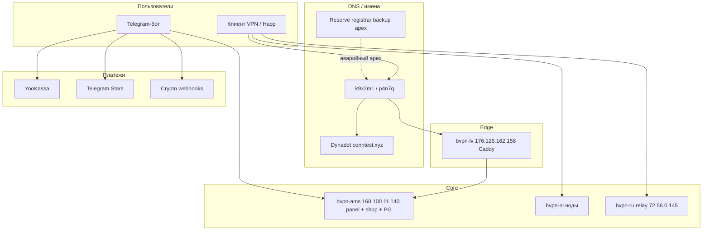

# Wiki: гео- и провайдер-диверсификация (P3-RED-JURIS-01)

**Задача:** снизить зависимость от одной юрисдикции (хостинг, регистратор, платёжный агент). Цель на день инцидента — **VPN и выдача подписки живы**, оплаты — **деградированы, но восстановимы** по runbook.

Секреты (логины VPS, ключи PSP, recovery-коды) — **Bitwarden / офлайн**, не в git.

## Карта зависимостей (прод 2026-05)

| Слой | Компонент | Юрисдикция / провайдер | Blast radius | Уже есть |
|------|-----------|------------------------|--------------|----------|
| **DNS** | `conntest.xyz` | Dynadot | Потеря зоны → все HTTPS-имена | **`DNS-CRITICAL-NAMES`**, backup apex, **`RUNBOOK-DNS-RED-TEAM`** |
| **Edge** | LV Caddy | VPS LV | Нет TLS/маршрутизации | NL не заменяет edge; нужен **новый IP + DNS** |
| **Панель / бот / PG** | AMS | VPS AMS | Нет админки, shop, БД | Бэкап PG → LV **`RUNBOOK-BACKUP-REMNAWAVE`**; накат только **`RUNBOOK-AMS-SAFE-DEPLOY`** |
| **Ноды** | NL (+ legacy AMS node drain) | VPS NL | Часть маршрутов | **`NODE-POLICY-LV-NL`**, balancer |
| **Подписка** | `p4n7q` + `k9x2m1` | 2 FQDN → один LV | Блок одного имени | **`RUNBOOK-P6-SUBSCRIPTION-MULTI-ORIGIN`**, HA **:3010/3011** |
| **Статус** | TG + HTTPS mirror | Meta + LV | Нет ops-канала | **`RUNBOOK-P2-STATUS-BOOT-CHANNEL`** |
| **Платежи** | YooKassa, Stars, crypto | РФ / TG / PSP | Нет пополнения | Webhook queue **P6-RED-PAY-01**; переключение канала в боте |

## Два сценария «за один день»

| Сценарий | Симптом | Runbook |
|----------|---------|---------|
| **A — отключили один VPS** | SSH/мониторинг молчит на LV **или** AMS; пользователи массово offline | **`RUNBOOK-JURISDICTION-FAILOVER.md` § A** |
| **B — отключили платёжку / агентство** | VPN OK, webhook/ЛК YooKassa недоступен, пополнение падает | **`RUNBOOK-JURISDICTION-FAILOVER.md` § B** |

## Документы и проверки

| Артефакт | Назначение |
|----------|------------|
| **`RUNBOOK-JURISDICTION-FAILOVER.md`** | Пошаговые действия T+0…24 ч |
| **`TABLETOP-JURISDICTION-EXERCISE.md`** | Учения раз в год (90 мин) |
| **`ops/jurisdiction_failover_inventory.json`** | Чеклист для smoke |
| **`python ops/jurisdiction_failover_audit.py`** | **`JURIS_FAILOVER_OK`** |

Связанные runbook: **`RUNBOOK-INCIDENT`**, **`RUNBOOK-DNS-RED-TEAM`**, **`RUNBOOK-AMS-SAFE-DEPLOY`**, **`RUNBOOK-COMMERCE-GO-LIVE`**, **`RUNBOOK-BACKUP-REMNAWAVE`**.

## Ручные хвосты владельца

- Второй регистратор + backup apex заполнен в **`dns_critical_inventory.json`** (см. **`MANUAL-OWNER-CHECKLIST`**).
- Контакты дежурных и PSP — в **Notion/private wiki**, не в репо.
- **Tabletop** — календарь: **1× в год** (шаблон **`TABLETOP-JURISDICTION-EXERCISE.md`**); итог — строка в **`COMMERCIAL-BACKLOG.md` §12**.
