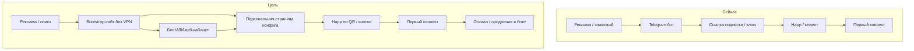

# BenderVPN — бэклог пользовательского флоу (P3-FLOW)

**Версия:** 2026-05-17  
**Цель:** путь клиента **без жаргона**, «для бабушки» — от «услышал про VPN» до **первого рабочего коннекта** и оплаты.  
**Связь:** задачи дублируются ID в **`docs/COMMERCIAL-BACKLOG.md` §7.1**; исполнение — линейная очередь **`docs/BACKLOG-QUEUE.md`** (фаза 3).  
**Карта пути (P3-FLOW-00):** **`docs/USER-FLOW-JOURNEY.md`**.

---

## 1. Принципы (не обсуждаются в спринте)

| # | Принцип |
|---|---------|
| 1 | **Ноль VPN для входа** — всё, что нужно до первого туннеля, открывается в обычном браузере / мессенджере без уже работающего VPN. |
| 2 | **Один главный путь** — кнопка «Подключить VPN» ведёт по шагам 1→2→3; «продвинутый» режим — свёрнут. |
| 3 | **Картинки > текст** — скриншоты Happ/iOS/Android, QR, короткое видео; текст — крупно, без TLS/Reality/shortUuid. |
| 4 | **Повторяемость** — одни и те же шаги в боте, на сайте и в FAQ (`ONBOARDING` = сайт = бот). |
| 5 | **Запасной выход** — на каждом шаге: «не получается» → поддержка, **`/status`**, ссылка на сайт с инструкцией. |
| 6 | **Не светить секреты** — персональная ссылка = capability URL; не индексировать; rate limit на краю. |

---

## 2. Каналы входа (после Q035–038)

| Канал | Без VPN | Статус |
|-------|---------|--------|
| **`/start`**, **`/portal/`** (браузер) | ✅ | **DONE** Q035 — bootstrap |
| **Telegram Mini App** (= portal) | ✅ в TG | **DONE** Q037 |
| **`/setup/?t=`** (персональная выдача) | ✅ | **DONE** Q036 — ссылка из бота Q038 |
| Telegram-бот (чат) | ❌ часто | Кабинет, оплата, поддержка |
| `/status` | ✅ | Статус, не конфиг |

**Остаётся:** мастер в боте (**Q039**), полировка Q040+, веб-ЛК Q048+.

---

## 3. Карта пути (as-is → to-be)

---

## 4. Задачи (ID = P3-FLOW-NN)

**Приоритет:** **MVP** (до массового GTM) → **Comfort** → **Scale**.

| ID | Приоритет | Задача | Done when | Verify |
|----|-----------|--------|-----------|--------|
| ~~**P3-FLOW-00**~~ ✅ | MVP | Карта флоу + бабушка-тест. | **`USER-FLOW-JOURNEY.md`** Q033. |
| ~~**P3-FLOW-14**~~ ✅ | MVP | Единый **`web/portal/`** + **`ru.json`**. | Q034 **`PORTAL_BUNDLE_OK`**. |
| ~~**P3-FLOW-01**~~ ✅ | MVP | Bootstrap **`/start`**, **`/portal/`**. | Q035 **`PUBLIC_BOOTSTRAP_OK`**. |
| ~~**P3-FLOW-02**~~ ✅ | MVP | **`/setup/?t=`** + QR + HMAC. | Q036 **`PORTAL_SETUP_PAGE_OK`**. |
| ~~**P3-FLOW-12**~~ ✅ | MVP | Mini App = portal. | Q037 **`TELEGRAM_MINIAPP_PORTAL_OK`**. |
| ~~**P3-FLOW-03**~~ ✅ | MVP | Бот: WebApp + браузер + setup. | Q038 **`BOT_PORTAL_LINKS_OK`**. |
| **P3-FLOW-04** | MVP | **Мастер «Подключить VPN»**; CTA → Mini App. | FSM; journey (**Q039 NEXT**). |
| **P3-FLOW-05** | Comfort | **QR подписки** в боте и на web-странице (PNG в чат / на сайте). | QR валиден для того же URL, что copy-paste. | Скан с iOS/Android → профиль в Happ. |
| **P3-FLOW-06** | Comfort | **Видео/GIF** «первый коннект» (iOS + Android), ≤ 90 с, хостинг на сайте (не только TG). | Два ролика или GIF; ссылка с bootstrap и из бота. | Просмотр без VPN с мобильного. |
| **P3-FLOW-07** | Comfort | **Синхронизация текстов**: FAQ (оплата live), онбординг, бот, сайт — одна правда. | **`FAQ.md`**, **`ONBOARDING.md`**, бот — без «оплата не подключена». | Diff-review + владелец OK. |
| **P3-FLOW-08** | Comfort | **Ошибки «по-человечески»** на сайте (те же коды, что **`USER-FACING-ERRORS.md`**). | Страница `/help/errors` или блок на bootstrap. | 5 типовых ошибок покрыты. |
| **P3-FLOW-09** | Comfort | **Выбор устройства**: iPhone / Android / **Windows** / **Mac** → ветка Happ (телефон **и** ПК). | Ветвление в боте + портал; подсказка «Happ на каждое устройство». | Каждая ветка ≤ 5 шагов. |
| **P3-FLOW-10** | Scale | **Воронка метрик**: visit сайта → start bot → key issued → sub HTTP 200 → (опц.) first connect proxy. | События в боте + access log bootstrap (без PII в git); wiki целей GTM. | Дашборд или еженедельный отчёт в §12. |
| **P3-FLOW-11** | Scale | **Запасной домен bootstrap** (если основной в реестре): второе имя + редирект, связь **P2-RED-SUB-01**. | Wiki + Caddy mirror; probe как sub origin. | Ручной тест с заблокированным основным доменом (tabletop). |
| **P3-FLOW-15** | Web LK | Баланс в веб-кабинете (read API). | Q048. |
| **P3-FLOW-16** | Web LK | Привязка TG ↔ web (`BVPN-ID`). | Q049. |
| **P3-FLOW-17** | Web LK | Уведомления без TG. | Q050. |
| **P3-FLOW-13** | Comfort | A11y portal ≥ 95. | Q045. |

### 4.1 Фидбек бета и ТСПУ (2026‑05‑18)

Полная матрица **12 пунктов** (что уже в продукте / что в очереди): **`docs/TSPU-OBSERVATIONS.md`**.

| ID | Приоритет | Задача | Q |
|----|-----------|--------|---|
| **P2-RED-EDGE-PORT-01** | **Срочно** | Порт edge **≠ 2053** | **051** |
| **P1-PRO-CLIENT-V2RAYN-01** | **Срочно** | v2rayN Windows | **052** |
| **P5-PROD-NATIVE-APP-01** | Долгий | Своё iOS/Android | **053** |
| **P2-RED-TSPU-VLESS-01** | Высокий | VLESS палево / ~15 дней на ТСПУ | **054** |
| **P1-RED-TSPU-BLOCK-01** | Высокий | Probe: >990, SSL handshake | **055** |
| **P2-RED-VPN-INBOUND-PORT-01** | Высокий | Inbound VPN порт при бане 443 | **056** |
| **P2-RED-SELFSTEAL-REVIEW-01** | Средний | Selfsteal/decoy — выключить? | **057** |
| **P2-RED-SNI-ROTATE-01** | Средний | SNI не github/bing кластер | **058** |
| **P1-RED-TSPU-THREAT-MODEL-01** | Средний | Wiki модель ТСПУ (п.7–9) | **059** |
| **P4-DNS-07/08** | P4 поток | RF egress + whitelist IP | **060** |
| **P1-RED-NODE-DNS-01** | Средний | DNS резолвер на нодах | **061** |

---

## 5. Архитектура bootstrap (рекомендация для FLOW-01/02)

| Компонент | Рекомендация | Не делать |
|-----------|--------------|-----------|
| **Хостинг** | Статика + лёгкий API на **LV Caddy** (тот же край, что **`/status`**) | Отдельный тяжёлый CMS |
| **URL** | Отдельный path, напр. **`https://k9x2m1.conntest.xyz:8443/start`** или поддомен **`start.conntest.xyz`** в **`site_urls.py`** | Путать с **`/api/sub/*`** (нагрузка, логи) |
| **Персональная страница** | `/setup/{token}` — token = HMAC(shortId + expiry) или панельный одноразовый код из бота | Публичный перебор shortId без rate limit |
| **Бот** | Генерирует tokenized URL после выдачи ключа | Хранить полный sub URL только в сообщении без web-дубля |
| **Блокировки** | Страница «TG не открывается» → только веб-ветка FLOW-02 | Единственный CTA «идите в Telegram» |

Детальный runbook — **`docs/RUNBOOK-USER-BOOTSTRAP-SITE.md`** (создать при старте **P3-FLOW-01**).

---

## 6. Порядок в очереди

**Источник истины:** **`docs/BACKLOG-QUEUE.md`**. Сводка: **`docs/BACKLOG-MAP.md`**.

| Q | ID | Статус |
|---|-----|--------|
| 032 | P5-COM-02 | **TODO** (до GTM) |
| 033–038 | FLOW-00, 14, 01, 02, 12, 03 | **DONE** |
| **051** | **P2-RED-EDGE-PORT-01** | **NEXT** (продукт) |
| **052–062** | ТСПУ + тиры sub | **TODO** |
| **044–050** | флоу / веб-ЛК | **TODO** после **Q062** |
| 045–047 | полировка | TODO |
| 048–050 | веб-ЛК | TODO |

---

## 7. Зависимости

| Задача | Ждёт | Можно параллельно |
|--------|------|-------------------|
| FLOW-01 | — | P5-COM-02 (юридика) |
| FLOW-02 | FLOW-01 (домен, Caddy) | P6 edge уже ✅ |
| FLOW-03 | FLOW-02 | — |
| FLOW-10 | FLOW-01, бот events | GTM wiki |
| FLOW-11 | P1-RED-DNS-01 ✅ | — |

---

## 8. Критерий «бабушка-тест» (приёмка эпика)

- [ ] Человек 60+ с iPhone, **без VPN**, за **15 минут**: зашёл на сайт → получил конфиг (web или бот) → Happ подключён → открылся `ya.ru` / проверочный сайт.
- [ ] Тот же сценарий при **недоступном Telegram** — только web-ветка (**FLOW-02**).
- [ ] На любом шаге есть **«Позвать поддержку»** и ссылка на **`/status`**.

---

*Документ: продуктовый бэклог флоу. Инженерный бэклог — **`COMMERCIAL-BACKLOG.md`**.*
