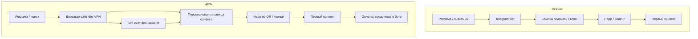

# BenderVPN — бэклог пользовательского флоу (P3-FLOW)

**Версия:** 2026-05-17  
**Цель:** путь клиента **без жаргона**, «для бабушки» — от «услышал про VPN» до **первого рабочего коннекта** и оплаты.  
**Связь:** задачи дублируются ID в **`docs/COMMERCIAL-BACKLOG.md` §7.1**; исполнение — линейная очередь **`docs/BACKLOG-QUEUE.md`** (фаза 3).  
**Карта пути (P3-FLOW-00):** **`docs/USER-FLOW-JOURNEY.md`**.

---

## 1. Принципы (не обсуждаются в спринте)

| # | Принцип |
|---|---------|
| 1 | **Ноль VPN для входа** — всё, что нужно до первого туннеля, открывается в обычном браузере / мессенджере без уже работающего VPN. |
| 2 | **Один главный путь** — кнопка «Подключить VPN» ведёт по шагам 1→2→3; «продвинутый» режим — свёрнут. |
| 3 | **Картинки > текст** — скриншоты Happ/iOS/Android, QR, короткое видео; текст — крупно, без TLS/Reality/shortUuid. |
| 4 | **Повторяемость** — одни и те же шаги в боте, на сайте и в FAQ (`ONBOARDING` = сайт = бот). |
| 5 | **Запасной выход** — на каждом шаге: «не получается» → поддержка, **`/status`**, ссылка на сайт с инструкцией. |
| 6 | **Не светить секреты** — персональная ссылка = capability URL; не индексировать; rate limit на краю. |

---

## 2. Проблема «курица и яйцо»

Сейчас основной выдающий канал — **Telegram-бот**. Если у клиента **нет VPN** и **Telegram заблокирован или нестабилен**, он **не доходит** до бота и не получает подписку.

| Канал сегодня | Без VPN | Комментарий |
|---------------|---------|-------------|
| Telegram-бот | ❌ часто | Зависит от блокировок TG |
| Подписка `p4n7q…/api/sub/…` | ✅ HTTP | Нужен **shortId** — клиент не знает URL |
| Панель Remnawave | ❌ | Только операторы |
| `/status` | ✅ | Статус, не выдача конфига |

**Целевое состояние:** публичный **bootstrap-сайт** (clearnet) + **персональная страница конфига** (ссылка из бота / SMS / QR) + бот как удобный повседневный кабинет **после** первого входа.

---

## 3. Карта пути (as-is → to-be)

---

## 4. Задачи (ID = P3-FLOW-NN)

**Приоритет:** **MVP** (до массового GTM) → **Comfort** → **Scale**.

| ID | Приоритет | Задача | Done when | Verify |
|----|-----------|--------|-----------|--------|
| **P3-FLOW-00** | MVP | Карта флоу + критерии «бабушка-тест» (3 персоны: iOS/Android/«только звонилки»). | **`docs/USER-FLOW-JOURNEY.md`** (или §3–4 здесь вынесены в отдельный файл); чеклист 10 шагов без жаргона. | Ревью владельца: 3 человека вне IT проходят сценарий на бумаге. |
| **P3-FLOW-01** | MVP | **Bootstrap-сайт** на clearnet (домен/путь **не** требует VPN): главная, «как подключить», ссылка на бота, ссылка на **`/status`**, legal. | HTTPS **200**; Lighthouse a11y ≥ 90 (mobile); контент синхронен с **`ONBOARDING.md`**; деплой через Caddy на LV (как **`/status`**). | `curl` с RU IP без VPN; smoke **`PUBLIC_BOOTSTRAP_OK`** (новый скрипт). |
| **P3-FLOW-02** | MVP | **Персональная выдача конфига на сайте**: страница по одноразовому/долгому токену или **shortId** (capability URL) — показать **ссылку подписки**, **QR**, кнопки «Открыть в Happ» (deep link где возможно). | Пользователь без VPN открывает ссылку с телефона → видит QR + «скопировать»; **не** отдаётся лишнее (JWT, внутренние hostnames). | E2E: бот выдал web-link → импорт в Happ → коннект; rate limit на краю. |
| **P3-FLOW-03** | MVP | **Связка бот ↔ сайт**: в боте кнопки «Открыть инструкцию на сайте», «Моя ссылка для настройки» (web-link из FLOW-02). | Кнопки в **`handlers.py`** / **`user_messages.py`**; URL из **`site_urls.py`**. | Smoke: новый пользователь получает обе ссылки за &lt; 3 тапов. |
| **P3-FLOW-04** | MVP | **Мастер в боте «Подключить VPN»**: 4–6 шагов (устройство → установить Happ → вставить подписку → включить → проверка). | Один FSM или цепочка сообщений; кнопки «Назад»; без англ. ошибок. | 2 тестера 55+ проходят без звонка в поддержку. |
| **P3-FLOW-05** | Comfort | **QR подписки** в боте и на web-странице (PNG в чат / на сайте). | QR валиден для того же URL, что copy-paste. | Скан с iOS/Android → профиль в Happ. |
| **P3-FLOW-06** | Comfort | **Видео/GIF** «первый коннект» (iOS + Android), ≤ 90 с, хостинг на сайте (не только TG). | Два ролика или GIF; ссылка с bootstrap и из бота. | Просмотр без VPN с мобильного. |
| **P3-FLOW-07** | Comfort | **Синхронизация текстов**: FAQ (оплата live), онбординг, бот, сайт — одна правда. | **`FAQ.md`**, **`ONBOARDING.md`**, бот — без «оплата не подключена». | Diff-review + владелец OK. |
| **P3-FLOW-08** | Comfort | **Ошибки «по-человечески»** на сайте (те же коды, что **`USER-FACING-ERRORS.md`**). | Страница `/help/errors` или блок на bootstrap. | 5 типовых ошибок покрыты. |
| **P3-FLOW-09** | Comfort | **Выбор устройства**: iPhone / Android / **Windows** / **Mac** → ветка Happ (телефон **и** ПК). | Ветвление в боте + портал; подсказка «Happ на каждое устройство». | Каждая ветка ≤ 5 шагов. |
| **P3-FLOW-10** | Scale | **Воронка метрик**: visit сайта → start bot → key issued → sub HTTP 200 → (опц.) first connect proxy. | События в боте + access log bootstrap (без PII в git); wiki целей GTM. | Дашборд или еженедельный отчёт в §12. |
| **P3-FLOW-11** | Scale | **Запасной домен bootstrap** (если основной в реестре): второе имя + редирект, связь **P2-RED-SUB-01**. | Wiki + Caddy mirror; probe как sub origin. | Ручной тест с заблокированным основным доменом (tabletop). |
| **P3-FLOW-12** | **MVP** | **Telegram Mini App** — **тот же** `web/portal/` что сайт (`/start` / `/portal`); Menu Button + inline WebApp; UX «бабушка». | **`TELEGRAM_MINIAPP_PORTAL_OK`**; визуально = сайт; `Telegram.WebApp` expand/theme. | Ручной тест в TG; **`RUNBOOK-TELEGRAM-MINIAPP`**. |
| **P3-FLOW-14** | **MVP** | **Единый портал** (контент + UI): `web/portal/`, `content/ru.json` — источник для сайта и Mini App. | Один JSON; index + setup HTML; **`site_urls.public_portal_url()`**. | Локальный smoke; нет дублирующих текстов в боте vs web. |
| **P3-FLOW-13** | Scale | **Доступность (a11y)**: контраст, размер шрифта 18px+, focus, `lang=ru`. | a11y audit bootstrap; исправления в CSS. | Lighthouse a11y ≥ 95. |

---

## 5. Архитектура bootstrap (рекомендация для FLOW-01/02)

| Компонент | Рекомендация | Не делать |
|-----------|--------------|-----------|
| **Хостинг** | Статика + лёгкий API на **LV Caddy** (тот же край, что **`/status`**) | Отдельный тяжёлый CMS |
| **URL** | Отдельный path, напр. **`https://k9x2m1.conntest.xyz:2053/start`** или поддомен **`start.conntest.xyz`** в **`site_urls.py`** | Путать с **`/api/sub/*`** (нагрузка, логи) |
| **Персональная страница** | `/setup/{token}` — token = HMAC(shortId + expiry) или панельный одноразовый код из бота | Публичный перебор shortId без rate limit |
| **Бот** | Генерирует tokenized URL после выдачи ключа | Хранить полный sub URL только в сообщении без web-дубля |
| **Блокировки** | Страница «TG не открывается» → только веб-ветка FLOW-02 | Единственный CTA «идите в Telegram» |

Детальный runbook — **`docs/RUNBOOK-USER-BOOTSTRAP-SITE.md`** (создать при старте **P3-FLOW-01**).

---

## 6. Порядок в очереди (предложение фазы 3)

См. **`docs/BACKLOG-QUEUE.md`** — фаза 3. Рекомендуемый **первый NEXT** после **P5-COM-02**:

| Q | ID | Почему |
|---|-----|--------|
| 032 | **P5-COM-02** | Возвраты до GTM (уже в §9) |
| 033 | **P3-FLOW-00** | Зафиксировать путь, не кодить вслепую |
| 034 | **P3-FLOW-14** | Единый `web/portal/` + ru.json (до деплоя) |
| 035 | **P3-FLOW-01** | Bootstrap `/start` на LV |
| 036 | **P3-FLOW-02** | Выдача конфига `/setup` |
| 037 | **P3-FLOW-12** | **Mini App** = тот же portal |
| 038 | **P3-FLOW-03** | Бот → WebApp + браузер + setup |
| 039 | **P3-FLOW-04** | Мастер в боте (CTA → Mini App) |
| 040 | **P3-FLOW-07** | FAQ/оплата |
| 041–047 | FLOW-05…11, 13 | Comfort / scale |

**Параллельно:** **P4-DNS** — отдельный SKU; не смешивать с **P3-FLOW** без явного решения владельца.

---

## 7. Зависимости

| Задача | Ждёт | Можно параллельно |
|--------|------|-------------------|
| FLOW-01 | — | P5-COM-02 (юридика) |
| FLOW-02 | FLOW-01 (домен, Caddy) | P6 edge уже ✅ |
| FLOW-03 | FLOW-02 | — |
| FLOW-10 | FLOW-01, бот events | GTM wiki |
| FLOW-11 | P1-RED-DNS-01 ✅ | — |

---

## 8. Критерий «бабушка-тест» (приёмка эпика)

- [ ] Человек 60+ с iPhone, **без VPN**, за **15 минут**: зашёл на сайт → получил конфиг (web или бот) → Happ подключён → открылся `ya.ru` / проверочный сайт.
- [ ] Тот же сценарий при **недоступном Telegram** — только web-ветка (**FLOW-02**).
- [ ] На любом шаге есть **«Позвать поддержку»** и ссылка на **`/status`**.

---

*Документ: продуктовый бэклог флоу. Инженерный бэклог — **`COMMERCIAL-BACKLOG.md`**.*
