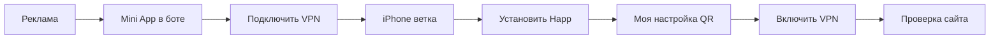
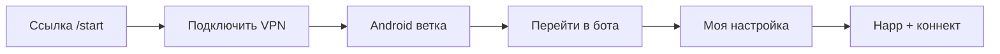
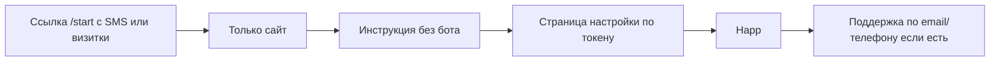
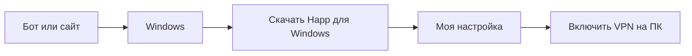

# Карта пути пользователя BenderVPN (P3-FLOW-00)

**Версия:** 2026-05-17  
**P3-FLOW-04 (Q039):** мастер «Подключить VPN» в боте — выбор устройства, Mini App, подсказки в чате.  
**Назначение:** единый сценарий «от рекламы до первого рабочего интернета» для сайта, Telegram Mini App и бота.  
**Связанные документы:** **`docs/USER-FLOW-BACKLOG.md`**, **`docs/ONBOARDING.md`**, **`docs/FAQ.md`**, **`docs/AGENT-FLOW-BACKLOG.md`**.

**Принцип:** один контент — три входа. Тексты на экранах позже лягут в **`web/portal/content/ru.json`**; здесь — смысл шагов без жаргона.

---

## As-is (бот сейчас) vs to-be (сайт / портал)

| | **Telegram-бот (прод, первое касание)** | **Сайт / Mini App (Q034+, деплой Q035+)** |
|---|----------------------------------------|-------------------------------------------|
| Шаг «какое устройство?» | **Нет** — отдельного вопроса перед инструкцией нет | **Да** — сначала «Подключить VPN», затем выбор **iPhone / Android / Windows / Mac** |
| Happ | Сразу две кнопки: **App Store** (iOS) и **Google Play** (Android); пользователь жмёт **свою** | Ссылка на магазин **после** выбора ОС (+ ветки Windows/Mac) |
| Windows / Mac | **Пока нет** в боте; только мобильные магазины | Есть в **`web/portal/content/ru.json`** |
| Ссылка настройки | В сообщении после trial / «Скопировать подписку» | Страница **`/setup`** (Q036) + бот |

**Итог:** в боте выбор устройства **неявный** (две кнопки магазина = по сути iOS или Android). На портале — **явный** выбор из четырёх платформ. Windows/Mac — через сайт, поддержку или будущие задачи **P3-FLOW-03/09**.

---

## Персоны (бабушка-тест)

| ID | Кто | Устройство | Контекст | Главный вход |
|----|-----|------------|----------|--------------|
| **P1** | Нина, 62 года | iPhone | Слышала про VPN от внука; Telegram есть, но путается в ссылках | Mini App или сайт |
| **P2** | Алексей, 38 лет | Android | Сам ставит приложения; пришёл из рекламы по ссылке | Сайт → бот |
| **P3** | Мария, 55 лет | Android | **Telegram не открывается** (блокировка/сеть); есть только браузер | **Только сайт** (web-ветка) |
| **P4** | Игорь, 42 года | **Mac** + iPhone | Работает на ноутбуке и телефоне; хочет VPN на обоих | Сайт → Happ на Mac и iPhone |
| **P5** | Светлана, 50 лет | **Windows** ПК | Домашний компьютер; Telegram на телефоне | Сайт / бот → Happ на Windows |

**Вне IT:** ни одна персона не должна слышать от нас: shortUuid, Reality, JWT, нода, inbound, TLS 1.3.

### Устройства и Happ

| Платформа | Нужен VPN? | Клиент |
|-----------|------------|--------|
| **iPhone / iPad** | Да | **Happ** (App Store) |
| **Android** | Да | **Happ** (Google Play / RuStore по доступности) |
| **Windows** (ПК, ноутбук) | Да | **Happ** (сайт разработчика / Microsoft Store — ссылка в портале) |
| **Mac** (MacBook, iMac) | Да | **Happ** (App Store для Mac) |

**Важно для пользователя:** Happ — **одно и то же приложение** для телефона и для компьютера, но **ставится на каждое устройство отдельно**. Ссылку «Моя настройка» нужно добавить в Happ **на том устройстве, где пользуетесь интернетом** (телефон **и/или** Windows **и/или** Mac).

---

## 10 шагов (один путь, три колонки)

Одинаковый смысл на **сайте** (`/start`), в **Mini App** (тот же URL `/portal`) и в **боте** (кнопки + короткие сообщения).

| # | Шаг (для пользователя) | Сайт | Mini App | Бот |
|---|------------------------|------|----------|-----|
| 1 | **Узнал про BenderVPN** | Открыл ссылку из рекламы / QR на **`/start`** без VPN | Нажал «Открыть» в Telegram → тот же экран | Нашёл бота по имени / перешёл из рекламы |
| 2 | **Понял, что это VPN для интернета** | Крупный заголовок + одна фраза «защищённый доступ» | То же | Короткое приветствие + кнопка «Подключить VPN» |
| 3 | **Выбрал «Подключить VPN»** | Большая кнопка на главной | Та же кнопка на весь экран | «Бесплатно 3 месяца» / главное меню после оферты |
| 4 | **Узнал, какое устройство** | «iPhone / Android / **Windows** / **Mac**» (4 кнопки) | То же | **Q039:** «Подключить VPN» → 4 устройства |
| 5 | **Установил Happ** | Магазин для выбранной ОС в портале | То же | **Q039:** Mini App по устройству или подсказки в чате + магазин |
| 6 | **Получил свою настройку** | Страница **`/setup?...`** по ссылке из бота / SMS / QR | Тот же URL внутри Mini App | Кнопка «Моя настройка» → web-link |
| 7 | **Добавил настройку в Happ** | QR + «Скопировать ссылку» + 3 пункта «Открыть Happ → Вставить → Сохранить» | QR + копирование через TG | Отправка ссылки + QR в чат |
| 8 | **Включил VPN в приложении** | Шаг «Включите переключатель» + картинка | То же | Текст + напоминание |
| 9 | **Проверил, что интернет работает** | «Откройте любой сайт, например ya.ru» | То же | «Напишите „работает“» или кнопка «Готово» |
| 10 | **Пополнил баланс / продлил** (когда нужно) | Ссылка «Перейти в бот для оплаты» (если TG доступен) | Кнопка «Оплата в боте» | Меню «Пополнить баланс» (Stars / карта / crypto) |

**Запасной выход на шагах 3–9:** кнопка **«Не получается»** → поддержка в Telegram (если доступен) + ссылка **`/status`** + текст «позвоните внуку / напишите в поддержку».

---

## Сценарии по персонам

### P1 — Нина (iPhone, есть Telegram)



**Цель:** ≤ **15 минут**, ≤ **5 нажатий** после открытия Mini App до рабочего VPN.

### P2 — Алексей (Android, сайт первым)



**Цель:** сайт объясняет путь; бот выдаёт персональную ссылку за **≤ 3 тапа**.

### P3 — Мария (Telegram недоступен)



**Критично:** на **`/start`** блок **«Telegram не открывается»** → только web-ветка (шаги 4–9 без упоминания «идите в бот» как единственного пути).

**Ограничение MVP:** выдача токена на **`/setup`** изначально создаётся **ботом**; для P3 владелец может выдать ссылку вручную (поддержка) до автоматизации SMS/email (**вне Q033**).

### P4 — Игорь (Mac + iPhone)

```mermaid
flowchart LR
  A[/start] --> B[Подключить VPN]
  B --> C[Выбор Mac или iPhone]
  C --> D1[Happ на Mac]
  C --> D2[Happ на iPhone]
  D1 --> E[Моя настройка на каждом]
  D2 --> E
  E --> F[VPN включён на обоих]
```

**Цель:** пользователь понимает, что **два устройства = два раза установить Happ**, одна ссылка настройки импортируется **на каждом**.

### P5 — Светлана (Windows)



**Цель:** не путать «VPN только на телефоне» — **компьютер тоже нужно настроить**, если с него выходят в интернет.

---

## Что говорим пользователю (словарь)

| Вместо | Говорим |
|--------|---------|
| Подписка / subscription URL | **«Ваша ссылка для настройки»** или **«Моя настройка»** |
| Ключ / VLESS | **«Настройка для приложения»** |
| Обновить подписку | **«Обновить настройку в приложении»** (кнопка Refresh) |
| Нода / сервер | **«Сервер VPN»** (на публичных страницах — только агрегат «всё работает» на **`/status`**) |
| Баланс / 6.67 ₽/день | **«Пополнить счёт»** + подсказка «хватит на N дней» |

---

## Синхронизация каналов (после реализации Q034+)

| Артефакт | Роль |
|----------|------|
| **`web/portal/content/ru.json`** | Единственный источник текстов сайта и Mini App |
| **`bot_src/user_messages.py`** | Бот: те же формулировки, URL из **`ops/site_urls.py`** |
| **`docs/ONBOARDING.md`** | Оператор поддержки: те же шаги |
| **`docs/FAQ.md`** | Юридика + «что покупаю» + оплата live |

**Публичные URL (план, см. `ops/site.env.example` после Q034):**

| URL | Назначение |
|-----|------------|
| `https://k9x2m1.conntest.xyz:2053/start` | Bootstrap без VPN |
| `https://k9x2m1.conntest.xyz:2053/portal/` | Mini App = тот же контент |
| `https://k9x2m1.conntest.xyz:2053/setup?...` | Персональная выдача (QR) |
| `https://k9x2m1.conntest.xyz:2053/status` | Статус сервиса (**P5-COM-01** ✅) |

---

## Критерии приёмки (бабушка-тест)

Скопировать в чеклист ревью владельца (**USER-FLOW-BACKLOG §8**).

### Обязательно перед GTM bootstrap

- [ ] **P1:** iPhone, без VPN, Mini App или сайт → Happ → рабочий сайт за **≤ 15 мин**
- [ ] **P2:** Android, сайт → бот → ссылка настройки за **≤ 3 тапа** в боте
- [ ] **P3:** сценарий на бумаге: только браузер, путь без обязательного Telegram описан и понятен тестеру 55+
- [ ] **P4 / P5:** Mac и Windows — Happ на компьютере описан без «только мобильный VPN»
- [ ] На каждом экране (макет/wireframe): **«Не получается»** + **`/status`**
- [ ] Нигде в пользовательских текстах: shortUuid, Reality, JWT, внутренние домены ops
- [ ] Оплата: в FAQ/боте/портале **одна правда** — пополнение баланса включено (**P3-FLOW-07**)

### Ревью владельца (Q033)

- [ ] Три человека **вне IT** прошли сценарий **на бумаге** (таблица 10 шагов)
- [ ] Замечания записаны в §12 или в комментарии к следующему Q

---

## Чеклист для агента (Q033 Done when)

- [x] Файл **`USER-FLOW-JOURNEY.md`** создан
- [x] 3 персоны (P1–P3)
- [x] 10 шагов × 3 колонки (сайт / Mini App / бот)
- [x] Критерии приёмки + ссылки ONBOARDING / FAQ
- [ ] Ревью владельца 3× бумажный прогон — **владелец** (не блокирует Q034 в репо)

---

## Web-only клиенты (браузерный trial, без Telegram)

**Как попадают в учёт сейчас**

| Слой | Что происходит |
|------|----------------|
| **Регистрация** | Email на `/setup/` → AMS `issue_web_trial` |
| **ID в БД бота** | Стабильный **отрицательный** `telegram_id` (surrogate из email), строка в `web_trial_claims`, ключ в `vpn_keys` |
| **Публичный ID** | **`BVPN-########`** — для поддержки и recover (не email в UI) |
| **Панель Remnawave** | Пользователь с `panel_email` вида `web…-trial@…`; подписка и `subscriptionUrl` как у TG-клиента |
| **Обновления конфига** | Карточка **«Обновления VPN»** на портале (`/api/ops/status.json` + `vpn_config.generation`) — **работает без TG** |
| **Push в Telegram** | Scheduler шлёт `bot.send_message(chat_id=user_id)` только на **реальные** TG id; для отрицательного surrogate доставка **невозможна** — клиент **не «на радаре»** для TG-push |

**Привязка web → Telegram (реализовано, P3-FLOW-16 MVP)**

1. После trial на `/setup/` — блок **«Подтвердить в Telegram»** (персональная ссылка `t.me/...?start=bind_<token>`).
2. В боте: принять оферту (если новый) → сообщение «Аккаунт привязан» → ключи и баланс на реальном `telegram_id`, push-уведомления работают.
3. **BVPN-ID** для поддержки не меняется.

**Дальше в бэклоге:** **P3-FLOW-15** (баланс в веб-ЛК), **P3-FLOW-17** (Web Push / email без TG).

---

## Следующие задачи в очереди

| Q | ID | Что строим |
|---|-----|------------|
| 034 | P3-FLOW-14 | `web/portal/` + `ru.json` |
| 035 | P3-FLOW-01 | Деплой `/start` на LV |
| 036 | P3-FLOW-02 | `/setup` + токен |
| 037 | P3-FLOW-12 | Mini App = portal |

Инструкции: **`docs/AGENT-FLOW-BACKLOG.md`**.
